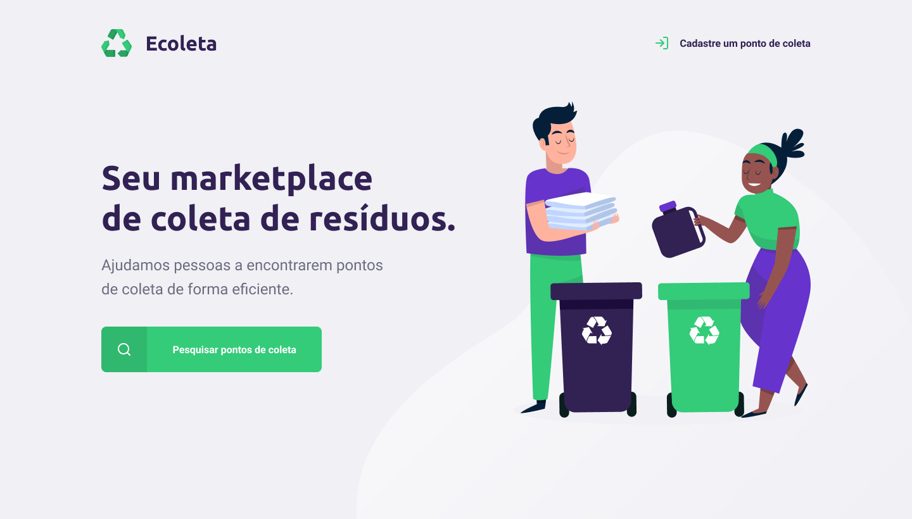

<h1 align="center">
    
</h1>

  
  <a href="#-projeto">Projeto</a>&nbsp;&nbsp;&nbsp;|&nbsp;&nbsp;&nbsp;
  <a href="#rocket-tecnologias">Tecnologias</a>&nbsp;&nbsp;&nbsp;|&nbsp;&nbsp;&nbsp;
  <a href="#-layout">Layout</a>&nbsp;&nbsp;&nbsp;|&nbsp;&nbsp;&nbsp;
  <a href="#-instalando">Como instalar</a>&nbsp;&nbsp;&nbsp;|&nbsp;&nbsp;&nbsp;

 

Ecoleta é um projeto desenvolvido durante a **Next Level Week #1** :rocket:.

## 💻 Projeto

O Ecoleta é um marketplace que ajuda pessoas a encontrarem pontos de coleta de resíduos de forma eficiente.

  

## 🚀 Tecnologias

Esse projeto foi desenvolvido com as seguintes tecnologias:

- [Node.js](https://nodejs.org/en/)
- [Express](https://expressjs.com/pt-br/)
- [SQLite](https://www.sqlite.org/index.html)
- [Nunjucks](https://mozilla.github.io/nunjucks/)

## 🔖 Layout

Você pode visualizar o layout do projeto no formato através [desse link](<https://www.figma.com/file/Byw4X5etg8VCmezueyhzkC/Ecoleta-(Starter)?node-id=136%3A546>). Lembrando que você irá precisar ter uma conta no [Figma](http://figma.com/).

## 🤔 Instalando

- Entre na pasta do projeto: `cd nome-da-pasta`
- Instale as depêndecias: `npm install`
- Inicia o projeto: `npm start`
- O aplicativo será executado em `http://localhost:3000/`;

---

Feito com ♥ by Anderson Dias
